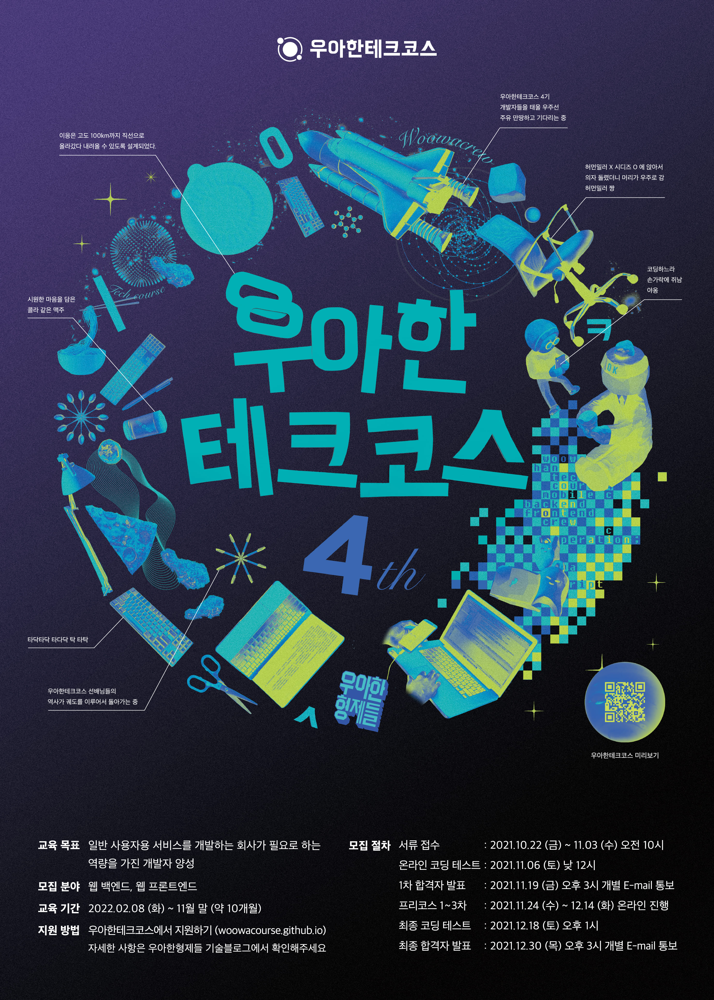

# 🚀 우아한테크코스 Projects

    

> [우아한테크코스](https://woowacourse.github.io/)에서 수행한 모든 프로젝트를 기록으로 남긴다.

- 기간 : `2022.02.08 - 2022.11.25`
- 각 프로젝트를 진행하면서 학습 및 회고한 내용들은 [블로그](https://velog.io/@dom_hxrdy)에 정리했습니다.

 

## 🐓 Level 4 : 팀 프로젝트 유지 보수 및 웹 프론트엔드에 깊이를 더하는 단계

### 기간

* ``2022.08.30 – 2022.10.29``

### 학습 목표

✅ 프론트엔드 성능을 측정, 분석하고 개선해본다. 
✅ TypeScript를 깊이있게 이해하고 다뤄본다. 
✅ 웹접근성 시나리오에 따라 적절한 속성을 추가할 수 있는 역량을 향상해본다.

### 진행 미션

| Step | Project | Repository | Pull Request |
|:---:|:---:|:---:|:---|
| 1 | 프론트엔드 성능 개선 | [perf-basecamp](https://github.com/DomMorello/perf-basecamp/tree/dommorello) | [Pull Request](https://github.com/woowacourse/perf-basecamp/pull/56) |
| 2 | 타입스크립트 심화 | [ts-module](https://github.com/DomMorello/ts-module/tree/dommorello) | [Pull Request](https://github.com/woowacourse/ts-module/pull/21) |
| 3 | 웹 접근성 | [a11y-airline-step1](https://github.com/DomMorello/a11y-airline/tree/dommorello) | [Pull Request](https://github.com/woowacourse/a11y-airline/pull/42) |
| | | [a11y-airline-step2](https://github.com/DomMorello/a11y-airline/tree/step2) | [Pull Request](https://github.com/woowacourse/a11y-airline/pull/70) |

 

## 🐥 Level 3 : Team Project

### 기간

* ``2022.06.28 - 2022.10.28``

### 학습 목표

✅ 개발 프로세스 기반으로 프로젝트 기획과 진행 및 협업하는 경험을 한다. 
✅ 시맨틱 버저닝, 테스트 자동화, 성능 최적화, 빌드 환경 개선 경험을 한다.

### 진행 미션

> 함께 회고하고 공유하는 회고 플랫폼, 회고덕 (Review-Duck) 개발 프로젝트 😇💪

| Category | Description |
|:---:| :---: |
| Service | [회고덕 (Review-Duck)](https://ducks.kr/) |
| Repository | [2022-review-duck](https://github.com/woowacourse-teams/2022-review-duck)|
| Tech Wiki | [2022-review-duck-wiki](https://github.com/woowacourse-teams/2022-review-duck/wiki) |
| 서비스 소개 | [Demo Day Site](https://sites.google.com/woowahan.com/woowacourse-demo-4th/%ED%94%84%EB%A1%9C%EC%A0%9D%ED%8A%B8/%ED%9A%8C%EA%B3%A0%EB%8D%95) |

### Demo Videos

| Category | Description |
|:---:| :---: |
| Video | [프로젝트 기획 & 팀 문화](https://www.youtube.com/watch?v=aCVpyqzl5og&ab_channel=%EC%9A%B0%EC%95%84%ED%95%9CTech) |
| Video | [브랜치 전략 & API 설계](https://www.youtube.com/watch?v=HaT3Owu-3Dk&t=182s&ab_channel=%EC%9A%B0%EC%95%84%ED%95%9CTech) |
| Video | [시맨틱 버저닝 & 기능 구현](https://www.youtube.com/watch?v=GeKxtyNXY3M&ab_channel=%EC%9A%B0%EC%95%84%ED%95%9CTech) |
| Video | [서비스 소개](https://www.youtube.com/watch?v=4De9K7QZQQk&ab_channel=%EC%9A%B0%EC%95%84%ED%95%9CTech) |
| Video | [성능 최적화]() |

 

## 🐣 Level 2 : Web Programming with React

### 기간

- `2022.04.19 - 2022.06.10`

### 학습 목표

✅ React 기반의 프론트엔드 웹 애플리케이션을 제작합니다. 
✅ 재사용 가능한 컴포넌트를 고민하고 설계합니다. 
✅ 상태 관리 라이브러리를 활용하며 상태 관리의 필요성에 대해 이해합니다. 
✅ 프론트엔드 웹 애플리케이션에서 고려해야할 테스트 범위와 종류에 대해 학습합니다.

### 진행 미션

| Step | Project  |                                     Repository                                      | Pull Request                                                            |
| :--: | :------: | :---------------------------------------------------------------------------------: | :---------------------------------------------------------------------- |
|  1   |  계산기  | [react-calculator-step1](https://github.com/DomMorello/react-calculator/tree/step1) | [Pull Request](https://github.com/woowacourse/react-calculator/pull/28) |
|      |          | [react-calculator-step2](https://github.com/DomMorello/react-calculator/tree/step2) | [Pull Request](https://github.com/woowacourse/react-calculator/pull/59) |
|  2   | 페이먼츠 |   [react-payments-step1](https://github.com/DomMorello/react-payments/tree/step1)   | [Pull Request](https://github.com/woowacourse/react-payments/pull/71)   |
|      |          |   [react-payments-step2](https://github.com/DomMorello/react-payments/tree/step2)   | [Pull Request](https://github.com/woowacourse/react-payments/pull/137)  |

 

## 🥚 Level 1 : TDD, Refactoring, Clean Code with JavaScript

### 기간

- `2022.02.08 - 2022.04.08`

### 학습 목표

✅ 프론트엔드의 기본이 되는 HTML, CSS, JavaScript에 대한 기본 문법을 익혀 프로그래밍을 합니다. 
✅ 구현한 코드에 대해 E2E 테스트, 유닛 테스트를 작성하고 읽기 좋은 코드로 리팩터링합니다.

### 진행 미션

| Step |       Project        |                                                 Repository                                                  | Pull Request                                                                         |
| :--: | :------------------: | :---------------------------------------------------------------------------------------------------------: | :----------------------------------------------------------------------------------- |
|  1   |   자동차 경주 게임   |      [javascript-racingcar-step2](https://github.com/DomMorello/javascript-racingcar/tree/dommorello)       | [Pull Request](https://github.com/woowacourse/javascript-racingcar/pull/115)         |
|  2   |         로또         |             [javascript-lotto-step1](https://github.com/DomMorello/javascript-lotto/tree/step1)             | [Pull Request](https://github.com/woowacourse/javascript-lotto/pull/108)             |
|      |                      |             [javascript-lotto-step2](https://github.com/DomMorello/javascript-lotto/tree/step2)             | [Pull Request](https://github.com/woowacourse/javascript-lotto/pull/126)             |
|  3   | 나만의 유투브 강의실 | [javascript-youtube-classroom-step1](https://github.com/DomMorello/javascript-youtube-classroom/tree/step1) | [Pull Request](https://github.com/woowacourse/javascript-youtube-classroom/pull/78)  |
|      |                      | [javascript-youtube-classroom-step2](https://github.com/DomMorello/javascript-youtube-classroom/tree/step2) | [Pull Request](https://github.com/woowacourse/javascript-youtube-classroom/pull/149) |

 

## 🌱 Pre-Course : 선발 과정

### 기간

- `2021.11.24 - 2021.12.18`

### 진행 미션

| Step |              Project               |                                                    Repository                                                     | Pull Request                                                                               |
| :--: | :--------------------------------: | :---------------------------------------------------------------------------------------------------------------: | :----------------------------------------------------------------------------------------- |
|  1   |           숫자 야구 게임           |       [javascript-baseball-precourse](https://github.com/DomMorello/javascript-baseball-precourse/tree/dom)       | [Pull Request](https://github.com/woowacourse/javascript-baseball-precourse/pull/138)      |
|  2   |          자동차 경주 게임          |      [javascript-racingcar-precourse](https://github.com/DomMorello/javascript-racingcar-precourse/tree/dom)      | [Pull Request](https://github.com/woowacourse/javascript-racingcar-precourse/pull/136)     |
|  3   |               자판기               | [javascript-vendingmachine-precourse](https://github.com/DomMorello/javascript-vendingmachine-precourse/tree/dom) | [Pull Request](https://github.com/woowacourse/javascript-vendingmachine-precourse/pull/33) |
| Exam | 우아한테크코스 크루 관리 & 팀 매칭 |   [javascript-teammatching-precourse](https://github.com/DomMorello/javascript-teammatching-precourse/tree/dom)   | [Pull Request](https://github.com/woowacourse/javascript-teammatching-precourse/pull/53)   |

 

## 📹 Tecotalk : 크루들에게 지식을 공유하는 방법

### 활동 목표

✅ 현장에서 필요한 말하기 능력을 향상시키기 위해 발표를 진행한다.

### 활동 내역

| Category | Description |
|:---:| :---: |
| Video | [[10분 테코톡] 🚴‍♂️ 돔하디의 VirtualDOM]([https://www.youtube.com/watch?v=Ry_gB34cvwc](https://www.youtube.com/watch?v=6rDBqVHSbgM&ab_channel=%EC%9A%B0%EC%95%84%ED%95%9CTech)) |

 

## 🖋 Writing : 글쓰기 코스

### 학습 목표

✅ 각 레벨 별로 한 편의 글을 완성하도록 한다.
✅ 한 편의 글에 자신의 생각과 감정을 논리적으로 담을 수 있도록 한다.
✅ 독자가 이해하기 쉬운 글을 작성한다.

### 진행 미션

| Level | Project | Repository | Pull Request |
|:---:|:---:|:---:|:---|
| 1 | 우아한테크코스 한 달 생활기 | [woowa-writing-4-level1](https://github.com/DomMorello/woowa-writing-4) | [Pull Request](https://github.com/woowacourse/woowa-writing-4/pull/44) |
| 2 | 우테코에서 찾은 나만의 효과적인 공부법 |[woowa-writing-4-level2](https://github.com/DomMorello/woowa-writing-4/blob/dommorello-2/level2.md) | [Pull Request](https://github.com/woowacourse/woowa-writing-4/pull/207) |
| 3 | 팀 프로젝트가 나에게 남긴 것 | [woowa-writing-4-level3](https://github.com/DomMorello/woowa-writing-4/blob/dommorello/level3.md) | [Pull Request](https://github.com/woowacourse/woowa-writing-4/pull/244) |
| 4 | 내가 꿈꾸는 프로그래머로서의 삶 | [woowa-writing-4-level4](https://github.com/DomMorello/woowa-writing-4/blob/dommorello-step4/step4.md) | [Pull Request](https://github.com/woowacourse/woowa-writing-4/pull/418) |

 

---
